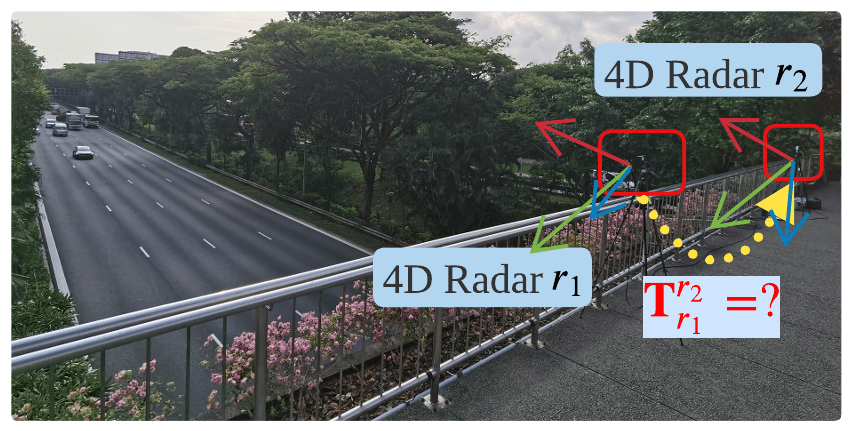
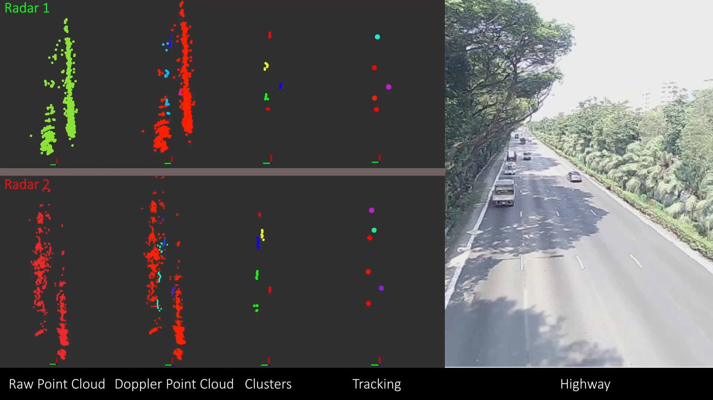
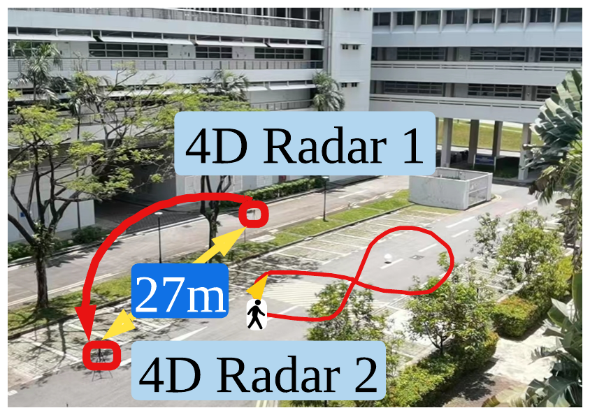
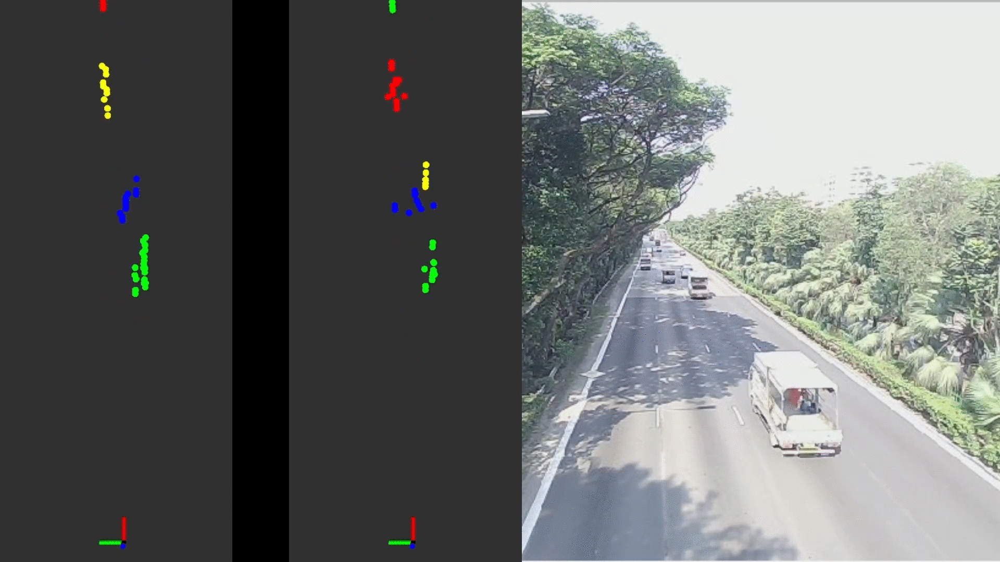

# LB-R2R-Calib-2.0
* Note: The paper is under review.
## Demos
### Highway
1. Raw Image

2. Calibration Flow

### GGPerp
 1. Raw Image

 2. Calibration Process

 3. Registered Trajectory

### GGPara

### AAOppo

### DBSCAN vs. V-DBSCAN
 