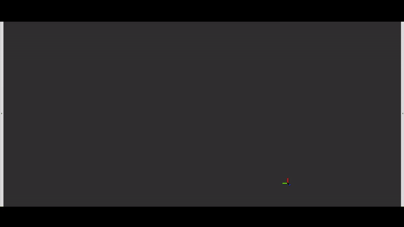

# LB-R2R-Calib-2.0
* Note: The paper is under review.

## Introduction

LB-R2R-Calib-2.0 is a new algorithm to calibrate long baseline multi-radars. Different from our previous work *offline* calibration LB-R2R-Calib [1], this 2.0 version is an *online* calibration method. 

## Motivation
Deploying multiple 4D radars on the roadside provides significant advantages for Vehicle-to-Everything (V2X) by enabling all-weather perception. 4D radar, with its unique advantages, such as all-weather perception, long-range sensing, direct doppler velocity measurement and low cost, offers irreplaceable benefits. Extrinsic calibration of multiple 4D radars mounted on the roadside with long baseline is crucial for fusing radar data into a unified coordinate system, which plays a key role in expanding the field-of-view (FOV) and improving perception coverage.

## Experimental Results

The first column presents the setup of four datasets, each with different baseline and viewpoint differences. These configurations represent typical scenarios: two radars positioned with opposite viewpoints (Opp), perpendicular viewpoints (Perp), parallel viewpoints (Para), and a configuration on a bridge above a highway. 

The second column displays the registered raw point cloud. 

The third and fourth columns show the top and side views, respectively, of the registered moving object trajectories, calibrated using LB-R2R-Calib-2.0. 

The fifth and sixth columns present the top and side views of the registered moving object trajectories, calibrated using LB-R2R-Calib-1.0. Note that for the highway scenario, ground truth data is not available.

## Demos

### Highway

<table>
  <tr>
    <th style="text-align:center;">Raw Image</th>
    <th style="text-align:center;">Calibration Flow</th>
  </tr>
  <tr>
    <td style="text-align:center;"></td>
    <td style="text-align:center;"></td>
  </tr>
</table>

### GGPerp

<table>
  <tr>
    <th style="text-align:center;">Raw Image</th>
    <!-- <th style="text-align:center;">Calibration Process</th> -->
    <th style="text-align:center;">Registered Trajectory</th>
  </tr>
  <tr>
    <td style="text-align:center;"></td>
    <!-- <td style="text-align:center;"></td> -->
    <td style="text-align:center;"></td>
  </tr>
</table>

### GGPara

<table>
  <tr>
    <th style="text-align:center;">Raw Image</th>
    <th style="text-align:center;">Registered Trajectory</th>
  </tr>
  <tr>
    <td style="text-align:center;"></td>
    <td style="text-align:center;"></td>
  </tr>
</table>

### AAOppo

<table>
  <tr>
    <th style="text-align:center;">Raw Image</th>
    <th style="text-align:center;">Registered Trajectory</th>
  </tr>
  <tr>
    <td style="text-align:center;"></td>
    <td style="text-align:center;"></td>
  </tr>
</table>

### DBSCAN vs. V-DBSCAN

 

[1] J. Zhang et al., "LB-R2R-Calib: Accurate and Robust Extrinsic Calibration of Multiple Long Baseline 4D Imaging Radars for V2X," 2024 IEEE International Conference on Robotics and Automation (ICRA), Yokohama, Japan, 2024
